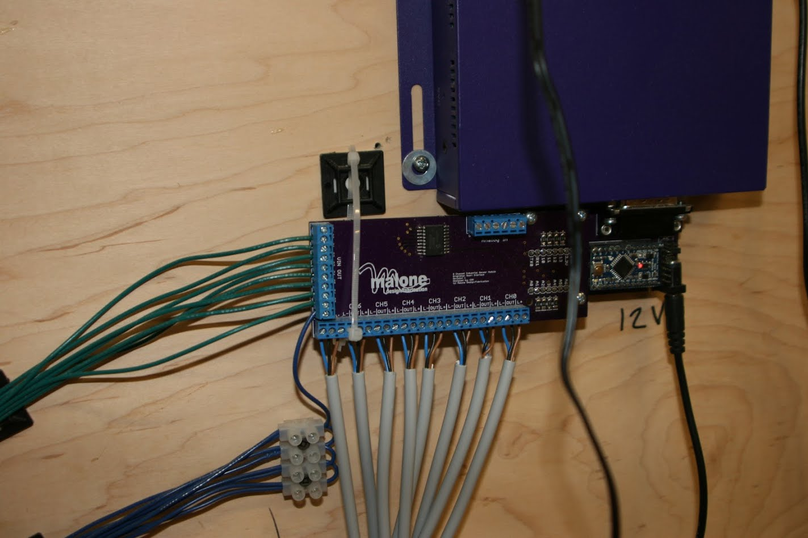
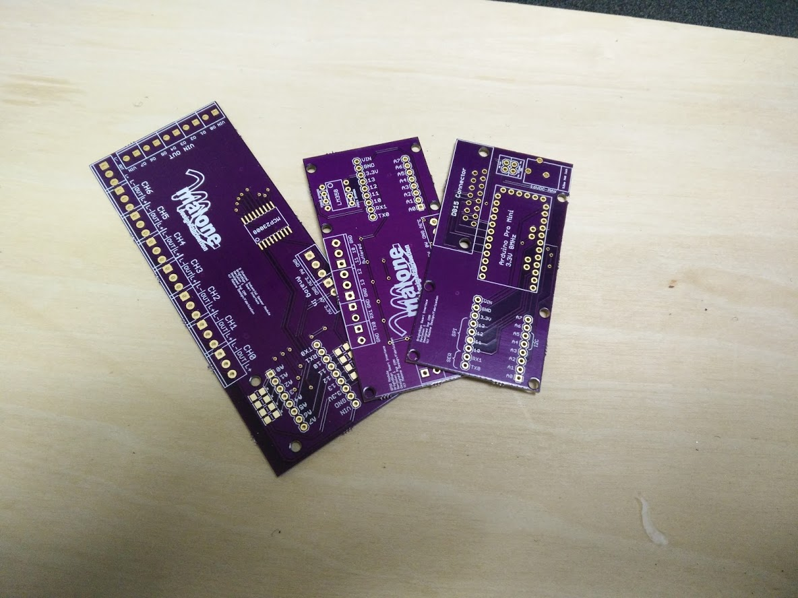
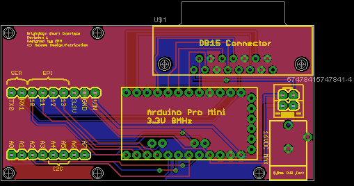
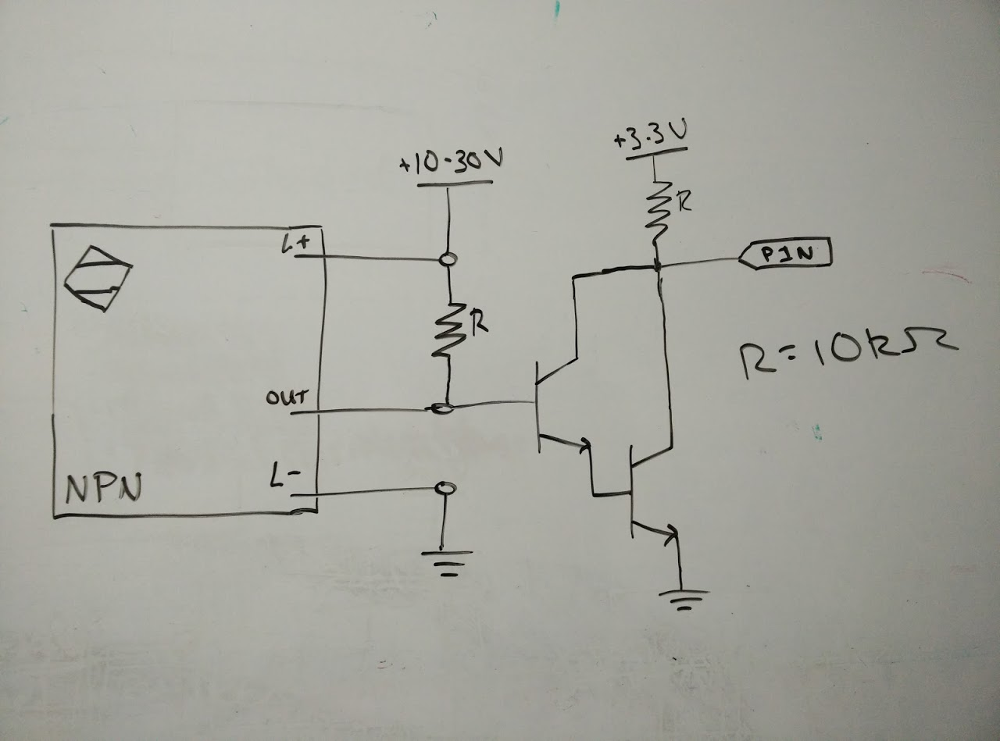
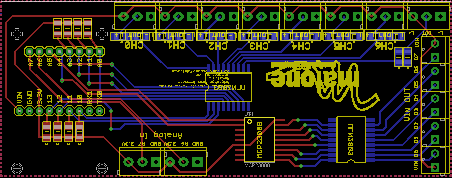

# BrightSign Smart Interface

The BrightSign Smart Interface (BSSI) is a system developed expand the capabilities of the [BrightSign](https://www.brightsign.biz/) digital signage controllers. A BrightSign has 8 GPIO pins used to control playback or out elements, however, the IO is limited to simple switching input making it less useful for interactive installations where complex input is used. The BSSI system is a set of boards that contain an Arduino along with support hardware specific to the interface type. This allows for the use of multiple and complex inputs and additional processing while controlling playback on the BrightSign. Current BrightSign players no longer support the connection type used in the BSSI.

## BSSI System

The BSSI system presently consists of three boards: the main board and two expansion boards: the GPIO board, and the industrial sensor board.

### Main Board

The main board contains the Arduino and serves as the primary interface to the BrightSign. The main board also contains a power adapter, allowing the Arduino and other peripherals to be powered externally rather than by the BrightSign.

### GPIO Board

The GPIO board simply break outs the remaining Arduino IO to headers. The board has locations on each pin for pull-up resistors and pins 10 and 11 are buffered (this can be bypassed).

### Industrial Sensor Board

The industrial sensor board can accept up to 7 channels of NPN type industrial sensors, 8 digital GPIO, and two analog inputs. It uses a port expander IC to achieve the high number of GPIO in addition to the sensor channels. The NPN sensor are connected using the following hardware interface:

## BSSI Library

An Arduino library for use the the BrightSign Smart Interface is also available. See README located in library directory for details.